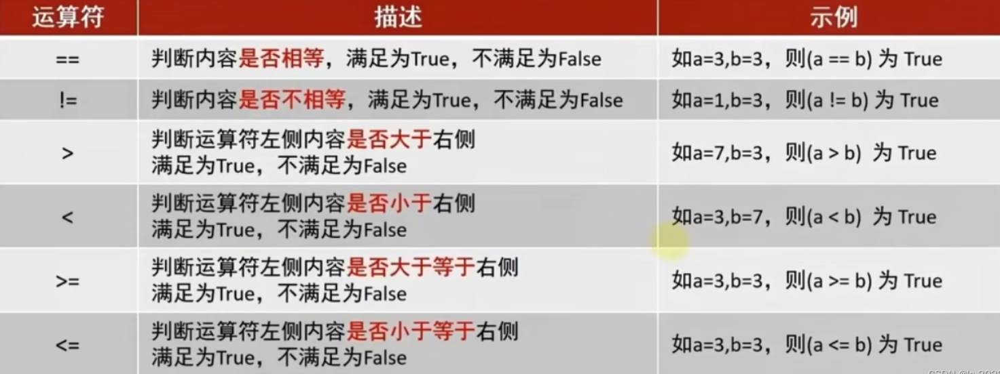

[toc]

# 一.python起源
# 二.python解释器
1.python解释器（在python安装目录里，python.exe）是一个计算机程序，用来翻译Python代码，并提交给计算机执行。

2.它的功能：
翻译代码，将python代码翻译成计算机能够识别的0和1二进制；
提交给计算机运行

3.pcharm的快捷键  
ctrl+ a :全选  
ctrl +c\v\x︰复制、粘贴、剪切   
**ctrl + d:复制当前行代码**   
**ctrl + /:注释\撤销注释**
**ctrl + f:搜索** 
**shift + alt +上\下:将当前行代码上移或下移** 
crtl + shift + f10:运行当前代码文件  
shift +f6∶重命名文件  
ctrl+ alt + s:打开软件设置  

# 三.python基础

## -第一章

### （一）字面量  
1.定义:在代码中,被写下来的固定的值,称之为字面量  

2.python中常用的6种值(数据)的类型


### （二）注释

1.定义:在程序代码中对程序代码进行解释说明的文字。

2.注释的分类

- a.单行注释：以#开头，#右边的所有文字当作说明，而不是真正要执行的程序，起辅助说明作用。注意：#号和注释内容一般建议以一个空格隔开。
- b.多行注释：以一对三个双引号 引起来（“”" 注释内容 “”"）来说明一段代码的作用使用方法。

### （三）变量

1.定义：在程序运行时，能够储存计算结果或能表示值的抽象概念。简单的说，变量就是在程序运行时，记录数据用的。

2.变量的定义格式：变量名称 = 变量的值

- 变量名称：每一个变量都有自己的名称，称之为：变量名，也就是变量本身。
- 变量的值：每一个变量都有自己存储的值（内容），称之为：变量值。
- **=：赋值**，表示将等号右侧的值，赋予左侧的变量

3.变量的特征：变量的值**可以改变**

### （四）数据类型

1.可以通过**type( )**，查看数据的类型，type( )是有返回值的。

2.我们通过type( 变量 )可以输出类型，这是查看变量的类型还是数据的类型？
查看的是：变量存储的数据的类型。因为，变量无类型，但是它存储的数据是有类型的。
注意：**变量是无类型的，变量存储的数据是有类型的。**

### （五）数据类型转换

1.为什么要转换类型？

- 数据类型之间，在特定的场景下，是可以相互转换的，如字符串转数字，数字转字符串等。

2.常见的转换语句

```python
int(x) #将x转换为一个整数
float(x) #将x转换为一个浮点数
str(x) #将x转换为一个字符串
"""
这三个语句都是带有结果的（返回值）
"""
123456
```

注意：浮点数转整数会丢失精度

### （六）标识符

1.定义：是用户在编程的时候所使用的一系列名字，用于给变量、类、方法等命名。

2.标识符命名规则：   内容限定；大小写敏感、不可使用关键字

-  a.内容限定：标识符命名中，只允许出现：英文、中文(不推荐使用)、数字(不可以用在开头)、下划线（__）
-  b.大小写敏感：大小写可以完全区分
-  c.不可使用关键字

3.标识符的命名规范

- 变量名的命名规范：见名知意、**下划线命名法**(多个单词组合变量名，需使用下划线做分隔)、**英文字母全小写**。

### （七）运算符

1.算术（数学）运算符

2.赋值运算符


3.复合赋值运算符


### （八）字符串
#### １.字符串三种定义形式

+ 单引号定义法: `name = 'hello!'`

+ 双引号定义法: name = "hello!"

+ 三引号定义法: `name = """hello!"""`
  + 三引号定义法，和多行注释的写法一样，同样支持换行操作。
    使用变量接收它，它就是字符串
    不使用变量接收它，就可以作为多行注释使用。

问题：如果想要定义的字符串本身　，是包含：单引号／双引号怎么写？

1. 单引号定义法:可以内含双引号
2. 双引号定义法:可以内含单引号
3. 可以使用转义字符（＼）来将引号解除效用，变成普通字符串。

#### ２.字符串的拼接

如果我们有两个字符串（文本）字面量，可以将其拼接成一个字符串，通过＋号即可完成。

注意事项：字符串本身进行拼接

#### ３.字符串格式化

 ａ．字符串格式化语法：

＂％占位符＂　％变量
%s
%表示:我要占位
s表示:将变量变成字符串放入占位的地方
我先占个位置,待会有一个变量过来,我把它变成字符串放到占位的位置

ｂ．常用占位符

 c.快速格式化：f:format
语法：f"内容{变量}" 
前面f对字符串进行标记,表示字符串里面将会有对应的占位符
注意：快速格式化不关注类型，也不能精度控制；适合对没有精度要求的时候快速使用

#### ４.字符串格式化的精度控制

我们可以使用辅助符号"m.n"来控制数据的宽度和精度

- m，控制宽度（小数点也算宽度），要求是数字（m很少使用）,设置的宽度小于数字自身不生效
- .n，控制小数点精度，要求是数字，会进行小数的四舍五入

示例:

- %5d:表示将整数的宽度控制在5位，如数字11，被设置为5d，用三个空格补足宽度（往前补）。
- .%5.2f:表示将宽度控制为5，将小数点精度设置为2小数点和小数部分也算入宽度计算。如，对11.345设置了%7.2f后，2个空格补足宽度，小数部分限制2位精度后，四舍五入为.35
- %.2f:表示不限制宽度，只设置小数点精度为2，如11.345设置%.2f后，结果是11.35

#### 5.对表达式进行格式

 a.表达式：一条具**有明确执行结果的代码语句**。如:5*2  

 b.如何格式化表达式：f"{表达式}" ; "%s%d%f % (表达式、表达式、表达式)

### （九）数据输入

1.input语句（是函数），获取键盘输入的数据

2.可以使用: input(提示信息)，用以在使用者输入内容之前显示提示信息。

3.要注意，无论键盘输入什么类型的数据，**获取到的数据永远都是字符串类型**
如果要用输入的数字进行布尔运算,需要先强制类型转换:
`temperature = float(input("请输入当前温度(℃):"))`


## -第二章

### (一)布尔类型和比较运算符 

布尔类型的字面量:
True 表示真(是,肯定)          False  表示假(否,否定)

1.布尔类型的定义：　变量名称　＝　布尔类型字面量

2.比较运算符


### (二)ｉｆ语句的基本格式

1.格式
ｉｆ 要判断的条件：
条件成立时,输出的语句

２．ｉｆ语句的注意事项：
判断条件的结果一定要是布尔类型；不要忘记判断条件后的:冒号；归属于if语句的代码块，需在前方填充4个空格缩进。

### (三）ｉｆ－ｅｌｓｅ组合判断语句

１．格式：
ｉｆ　要判断的条件：
条件成立时，输出的语句．．．．．．
ｅｌｓｅ：
条件不成立时，输出的语句．．．．．．

２．注意事项：
else不需要判断条件，当ｉｆ的条件不满足时，ｅｌｓｅ执行；和if的代码块一样，else的代码块同样需要4个空格作为缩进。

### (四)ｉｆ－ｅｌｉｆ　－ｅｌｓｅ组合判断语句

１．格式

２．作用：可以完成多个条件的判断

３．注意：elif可以写多个；判断是互斥且有序的，上一个满足后面的就不会判断了；可以在条件判断中，直接写input语句，节省代码量。

### (五)判断语句的嵌套

1.基本语法：

2.注意点：
嵌套判断语句可以用于多条件、多层次的逻辑判断；
嵌套判断语句可以根据需求，自由组合if elif else来构建多层次判断；
嵌套判断语句，一定要注意空格缩进，**Python通过空格缩进来决定层次关系**。


## -第三章

### (一)while循环

1.语法格式：

2.注意点：
条件需提供布尔类型结果，True继续，False停止；空格缩进不能忘；请**规划好循环终止条件**﹐否则将无限循环。

### (二)while循环嵌套

1.语法格式：

2.注意点：
同判断语句的嵌套一样，循环语句的嵌套，要注意空格缩进；基于空格缩进来决定层次关系；
注意条件的设置，避免出现无限循环（除非真的需要无限循环)

### (三)补充知识点

1.输出不换行(print语句输出内容自动换行)

```python
print（"hello",end=''）
print（"world",end=''）
```

2.制表符 \t

3.九九乘法表

```python
i =1
while i <= 9 :
    j = 1
    while j <= i:
        print(f"{j}*{i}={i*j}",end="\t")
        j+=1
    i+=1
    print()
```

### (四)for循环

1.语法格式：

2.注意点：无法定义循环条件只能被动取出数据处理；要注意循环内的语句，需要有空格缩进。

3.完成内容统计

```python
name1 = "itheima is a brand of itcast"
i = 0
for x in name1:
    if x == 'a':
        i+=1
print("一共有%d个a"%i)
123456
```

4.range语句

```python
#range语法1 range(num)
for x in range(10):
    # 输出0-9,不包含10
    print(x)
#range语法2 range(num1,num2)
for x in range(5,10):
    # 输出5-9的一个数字序列,不包含10
    print(x)
#range语法3 range(num1,num2,step)
for x in range(5,10,2):
    # 输出5,7,9的一个数字序列,数字间隔为2,不包含10
    print(x)
```

5.for循环中的临时变量，其作用域限定为:循环内
这种限定:是编程规范的限定，而非强制限定；不遵守也能正常运行，但是不建议这样做；如需访问临时变量，可以预先在循环外定义它

### (五)for循环嵌套

1.语法：

2.注意事项：

需要注意缩进，嵌套for循环同样通过缩进确定层次关系；for循环和while循环可以相互嵌套使用

```python
# 小练习
for x in range (1,11):
    print("今天是表白第%s天"%x)
    for j in range(1, 6):
        print("今天是第%s朵玫瑰花" %j)
    print("喜欢你")
print(f"第{x}天表白成功")
# 九九乘法表
for i in range (1,10):
    for j in range (1,i+1):
        print(f"{j}*{i}={i*j}\t",end='')
    print()
```


### (六)continue和break

1.continue(临时跳过)
中断所在循环的当次执行，直接进入下一次

2.break(直接跳过)
直接结束所在循环

3.注意事项
continue和break，在for和while循环中作用一致；
在嵌套循环中，只能作用在所在的循环上，无法对上层循环起作用

4.综合案例

```python
money = 10000
for i in range(1,21):
    import random
    num = random.randint(1,10)
    if num < 5:
        print(f"员工{i}绩效小于5，不发放工资")
        continue
    if money >=1000:
        money-= 1000
        print(f"员工{i}领到工资1000元，公司账户还剩{money}元")
    else:
        print(f"公司账户还剩{money}元，公司没有余额下个月发放")
        break
```


## -第四章

### (一)函数初体验

1.函数：组织好的、可重复使用的、用来实现特定功能的代码段。

2.函数的好处：将功能封装在函数内，可供随时随地重复利用；提高代码的复用性，减少重复代码，提高开发效率。

### (二)函数的基础定义语法

1.定义语法:

2.函数使用步骤：
先定义后使用

3.注意事项：
参数如不需要，可以省略；返回值如不需要，可以省略；函数必须先定义后使用。

### (三)函数的传入参数

1.传入参数的功能是:在函数进行计算的时候，接受外部（调用时）提供的数据。

```python
def add(x,y):
    return x + y
print(add(1,2))
```

2.函数定义中，提供的x和y，称之为∶形式参数（**形参**)，表示函数声明将要使用2个参数
参数之间使用逗号进行分隔。

函数调用中，提供的1和2，称之为:实际参数（**实参**)，表示函数执行时真正使用的参数值
传入的时候，按照顺序传入数据，使用逗号分隔。

3.注意事项：
函数定义中的参数，称之为形式参数；函数调用中的参数，称之为实际参数；函数的参数数量不限，使用逗号分隔开；传入参数的时候，要和形式参数一一对应，逗号隔开。

### (四)函数的返回值

1.返回值的作用：
函数在执行完成后，返回给调用者的结果；使用  return  来返回结果。

2.返回值的语法：


３．注意：函数体在遇到return后就结束了，所以写在return后的代码不会执行。

```python
def example_function():
    print("函数开始执行")
    return "返回值"
    print("这段代码不会被执行")  # 这行代码在return之后，不会被执行

result = example_function()
print(result)
```

### (五)函数返回值之Ｎｏｎｅ类型

1.什么是None
None是类型’NoneType’的字面量，用于表示:空的、无意义的

2.函数如何返回None
不使用return语句即返回None；主动return None

3.使用场景
函数返回值；if判断(None等同于False)；变量定义(name=None)

### (六)函数的说明文档

１．作用：对函数进行说明解释，帮助更好理解函数功能。

２．语法：


### (七)函数的嵌套调用

１．定义：在一个函数中调用另一个函数

２．执行流程
函数A中执行到调用函数B的语句，会将函数B全部执行完成后，继续执行函数A的剩余内容。

### (八)变量在函数中的作用域

１．局部变量：作用范围在函数内部，在函数外部无法使用。

２．全局变量：在函数内部和外部均可使用。

３．如何将函数内定义的变量声明为全局变量？(在函数内修改全局变量)

使用ｇｌｏｂａｌ关键字，ｇｌｏｂａｌ变量。

### (九)综合案例

```python
money = 666666
name = None
name = input("输入客户名字:")
def query(show_header):
    if show_header:
        print("------查询余额------")
    print(f"您好{name}，您的余额为{money}元")
def saving(num):
    print("------存款------")
    global money
    money += num
    print(f"您好{name}，您存款{num}元成功")
    query(False)
def get_money(num):
    print("------取款------")
    global money
    money -= num
    print(f"您好{name}，您取款{num}元成功")
    query(False)
def main():
    print("------主菜单------")
    print(f"您好{name}，欢迎来到ATM，请选择操作:")
    print("查询余额\t[输入1]")
    print("存款\t\t[输入2]")
    print("取款\t\t[输入3]")
    print("退出\t\t[输入4]")
    return input("请输入您的选择:")
while True:
    key = main()
    if key == '1':
        query(True)
        continue
    elif key == '2':
        num = int(input("您存多少钱？"))
        saving(num)
        continue
    elif key == '3':
        num = int(input("您取多少钱？"))
        get_money(num)
        continue
    else:
        print("程序退出！")
        break
```


## -第五章

### (一)数据容器

#### 1.定义：

一种可以容纳多份数据的数据类型，容纳的每一份数据称之为1个元素,每一个元素，可以是任意类型的数据，如字符串、数字、布尔等。

#### 2.容器的种类：

list(列表)、tuple(元组)、str(字符串)、set(集合)、dict(字典)，它们各有特点，但都满足可容纳多个元素的特性。

### (二)列表

#### 1.定义语法：
#### 2.元素：

数据容器内的每一份数据，都称之为元素。

#### 3.元素的类型不受限制：

元素的数据类型没有任何限制，甚至元素也可以是列表，这样就定义了嵌套列表。

```python
list = ['h','s','z',['c','p','y'],1]
print(list)
print(type(list))
```

#### 4.列表的下标索引：

 a.定义：列表的每一个元素，都有编号称之为下标索引；从前向后的方向，编号从0开始递增；从后向前的方向，编号从-1开始递减

 b.如何通过下标索引取出对应位置的元素：列表[下表] 即可取出

 c.注意：要注意下标索引的取值范围，超出范围无法取出元素，并且会报错

```python
# 从前往后索引 0,1,2
print(list[1])
# 从后往前索引 -1,-2,-3
print(list[-5])
# 嵌套索引
print(list[3][0])
```

#### 5.列表的常用操作：


在Python中，如果将函数定义为class(类）的成员，那么函数会称之为:方法；方法和函数功能一样，有传入参数，有返回值，只是方法的使用格式不同。

```python
#函数的使用：
num = add（1,2）
#方法的使用：
student = Student（）
num = student.add（1,2）
```

 a.查找某元素的下标
 功能:查找指定元素在列表的下标，如果找不到，报错ValueError
 语法:列表.index(元素)；index就是列表对象（变量)内置的方法（函数)

```python
list.index('h')
```

 b.修改特定位置（索引）的元素值:
语法: 列表[下标]=值
可以使用如上语法，直接对指定下标（正向、反向下标均可）的值进行:重新赋值（修改)

```python
list[0] = '韩'
```

 c.插入元素:
语法: 列表.insert(下标,元素)，在指定的下标位置，插入指定的元素

```python
list.insert(1,'述')
```

 d.追加元素:
语法1: 列表.append(元素)，将指定元素，追加到列表的尾部
语法2: 列表.extend(其它数据容器)，将其它数据容器的内容取出，依次追加到列表尾部

```python
list.append('多啦A萌')
list.extend(['很','可','爱'])
```

 e.删除元素:
语法1: del列表[下标]
语法2: 列表.pop(下标)

```python
del list[3]
list.pop(3)
```

 f.删除某元素在列表中的第一个匹配项
语法:列表.remove(元素)

```python
list.remove('s')
```

 g.清空列表内容
 语法:列表.clear()

```python
list.clear()
```

 h.统计某元素在列表内的数量
语法:列表.count(元素)

```python
list.count('可')
```

 i.统计列表内，有多少元素
语法: len(列表)
可以得到一个int数字，表示列表内的元素数量

```python
print(len(list))
```

#### 6.列表的特点：

可以容纳多个元素（上限为2**63-1、9223372036854775807个)；可以容纳不同类型的元素（混装)；
数据是有序存储的（有下标序号)；
允许重复数据存在； 
可以修改（增加或删除元素等)

```python
#练习
list = [21,25,21,23,22,20]
list.append(31)
list.extend([29,33,30])
print(list[0])
print(list[-1])
print(list.index(31))
print(list)
```

#### 7.列表的遍历：

遍历：将容器内的元素依次取出，并处理，称之为遍历操作。

```python
#  while循环遍历
def list_while():
    list = ['a','b','c','d']
    num = 0
    while num< len(list):
        print(list[num])
        num+=1
list_while()
#  for循环遍历
def list_for():
    list = ['a', 'b', 'c', 'd']
    for x in list:
        print(str(x))
list_for()
```

while循环和for循环，都是循环语句，但细节不同:

在循环控制上:
while循环可以自定循环条件﹐并自行控制；for循环不可以自定循环条件﹐只可以一个个从容器内取出数据

在无限循环上:
while循环可以通过条件控制做到无限循环；for循环理论上不可以，因为被遍历的容器容量不是无限的。

在使用场景上:
while循环适用于任何想要循环的场景；for循环适用于，遍历数据容器的场景或简单的固定次数循环场景。

for循环更简单，while更灵活；for用于从容器内依次取出元素并处理,while用以任何需要循环的场景。

#### 综合案例

```python
#取出list中的偶数放入另一个列表中
#for循环
list = [1,2,3,4,5,6,7,8,9,10]
list_for = []
for x in list:
    if x % 2==0:
        list_for.append(x)
print(list_for)
#while循环
list = [1,2,3,4,5,6,7,8,9,10]
list_while = []
num = 0
while num < len(list):
    if list[num] % 2 == 0:
        list_while.append(list[num])
    num += 1
print(list_while)
```

### (三)元组

#### 1.元组定义:

定义元组使用小括号，且使用逗号隔开各个数据，数据可以是不同的数据类型。

**元组不可修改内容（可以修改内部list的内部元素)**

元组的下标：从前向后，下标从0开始从后向前，下标从-1开始

```python
#方式一
变量名称 = （）
#方式二
变量名称 =  tuple（）
# 定义单个元素的元组，后面必须加一个逗号，不然它的类型不是tuple而是其他
tuple = (1,)
# 元组的嵌套
t1 = ((1,'多',True),(2,'la',False))
print(type(t1))
print(t1)
# 下表索引取出内容
print(t1[0])
print(t1[0][0])
```

#### 2.元组的操作：

```python
t1.index('梦')
tuple.count('s')
len(t1)
```

#### 3.元组的遍历：

```python
#元组的遍历: while
index = 0
while index < len(t1):
    print(f"while:元组的元素有: {t1[index]}")
    #至关重要
    index += 1
#元组的遍历:for
for element in t1:
    print(f"for:元组的元素有: {element}")
1
```

#### 4.元组的特点：

和list基本相同（有序、任意数量元素、允许重复元素)，唯一不同在于不可修改。支持for循环

```python
tuple = ('周小轮',22,['basketball','music'])
print(f"年龄的下标位置：{tuple.index(22)}")
print(f"学生的姓名为：{tuple[0]}")
del tuple[2][0]
tuple[2].append('coding')
print(f"tuble的内容是{tuple}")
```

### (四)字符串
#### 1.字符串的下标：

从前向后，下标从0开始从后向前，下标从-1开始

```python
my_str = "itheima and itcast"
#通过下标索引取值
value = my_str[2]
value2 = my_str[-16]
print(f"从字符串{my_str}取下标为2的元素，。值是: {value},取下标为-16的元素。值是: {value2}")
```

#### 2.字符串的常用操作：

 a.i查找下标

```python
#index方法：
value = my_str.index( "and" )
print(f"在字符串{my_str}中查找and，其起始下标是: {value}")
```

 b.字符串替换

 语法:字符串.replace(字符串1，字符串2)

 功能:将字符串内的全部:字符串1，替换为字符串2

 注意:**不是修改字符串本身，而是得到了一个新字符串**哦

```python
#replace方法
new_my_str = my_str.replace( "it"，"程序")
print(f"将字符串{my_str}，进行替换后得到: {new_my_str}")
```

 c.字符串的分割

 语法:字符串.split(分隔符字符串)

 功能:按照指定的分隔符字符串，将字符串划分为多个字符串，并存入列表对象中

 注意:**字符串本身不变，而是得到了一个列表对象**

```python
# split方法
my_str = "hello python itheima itcast"
my_str_list = my_str.split("")
print(f"将字符串{my_str}进行split切分后得到: {my_str_list}，类型是: {type(my_str_list)}")
```

 d.字符串的规整

 字符串的规整操作(去前后空格)语法:字符串.strip()

 字符串的规整操作（去前后指定字符串)语法:字符串.strip(字符串)

```python
# strip方法
my_str = " itheima and itcast"
new_my_str = my_str.strip()#不传入参数，去除首尾空格
print(f"字符串{my_str}被strip后，结果: {new_my_str}")

my_str = "12itheima and itcast21"
new_my_str = my_str.strip( "12")
print(f"字符串{my_str}被strip( '12')后，结果: {new_my_str}")
```

 e.统计字符串中某个字符出现的次数

```python
my_str.count("it")
```

 f.统计字符串长度

```python
len(my_str)
```


#### 3.字符串的遍历：

```python
str = "itheima itcast boxuegu"
for x in str:
    print(f"for循环遍历字符串{x}")
index = 0
while index<len(str):
    print(f"while循环遍历字符串{str[index]}")
    index+=1
```

#### 4.字符串的特点：

只可以存储字符串；
长度任意（取决于内存大小)；
支持下标索引；
允许重复字符串存在；
不可以修改（增加或删除元素等)；
支持for循环

#### 5.字符串大小的比较：

字符串是按位比较，也就是一位位进行对比，只要有一位大，那么整体就大。

#### 6.综合案例

```python
str = "itheima itcast boxuegu"
print(f"有{str.count('it')}个it字符")
new_str = str.replace(" ","|")
print(f"原来的字符串{str}，被替换后的字符串{new_str}")
list = str.split("|")
print(f"字符串{str}按照 | 分割后的结果为：{list}")
```

### (五)序列

#### 1.定义：

内容连续、有序，可使用下标索引的一类数据容器
**常见类型**：列表（`list`）、元组（`tuple`）、字符串（`str`）

#### 2.切片

从一个序列中，取出一个子序列

序列支持切片，即:列表、元组、字符串，均支持进行切片操作

#### 3.切片的语法

**语法:序列[起始下标:结束下标:步长]**

- **起始下标**（包含）：默认为0（正向）或-1（反向）。
- **结束下标**（不包含）：默认为序列末尾（正向）或序列开头（反向）。
- **步长**：决定取元素的**间隔和方向**，正数为正向，负数为反向。

```python
#对list进行切片，从1开始，4结束，步长
list = [0,1,2,3,4,5,6]
print(list[1:4:1])
#对tuple进行切片，从头开始，到最后结束，步长1
tuple = (0,1,2,3,4,5,6)
print(tuple[::])
#对str进行切片，从头开始，到最后结束，步长2
str = '0123456'
print(str[::2])
#对str进行切片，从头开始，到最后结束，步长-1
print(str[::-1])
#对列表进行切片，从3开始，到1结束，步长-1
print(list[3:1:-1])
#对元组进行切片，从头开始，到尾结束，步长-2
print(tuple[::-2])
```

#### 4.综合案例

```python
my_str='万过薪月，员序程马黑来，nohtyP学'
start = my_str.index('员')
end = my_str.index("黑")
new_str = my_str[start:end+1:]
print(new_str[::-1])
#对比两段代码的输出语句
my_str='万过薪月，员序程马黑来，nohtyP学'
start = my_str.index('员')
end = my_str.index("黑")
print(my_str[start:end + 1:][::-1])
#通过字符串分隔
print(my_str.split("，")[1].replace("来","")[::-1])
```

### (六)集合
#### 1.定义语法

因为**集合是无序的**，所以集合不支持:下标索引访问。


#### 2.操作

 a.添加新元素

 语法:集合.add(元素)。将指定元素，添加到集合内。

 结果:集合本身被修改，添加了新元素。

 b.移除元素

 语法:集合.remove(元素)，将指定元素，从集合内移除。

 结果:集合本身被修改，移除了元素。

 c.随机取出元素

 语法∶集合.pop()功能，从集合中随机取出一个元素。

 结果:会得到一个元素的结果。同时集合本身被修改，元素被移除。

 d.清空集合

 集合.clear()

 e.取两个集合的差集

 语法∶集合1.difference(集合2)

 功能:取出集合1和集合2的差集（集合1有而集合2没有的)

 结果:得到一个新集合，集合1和集合2不变

 f.消除两个集合的差集

 语法:集合1.difference_update(集合2)

 功能:对比集合1和集合2，在集合1内，删除和集合2相同的元素。

 结果:集合1被修改，集合2不变

 g.两个集合合并

 语法:集合1.union(集合2)

 功能:将集合1和集合2组合成新集合

 结果:得到新集合，集合1和集合2不变

 h.统计集合元素个数

 语法:len（集合）

```python
# 定义集合
set_1 = {'多','la','A','梦','多'}
# 定义空集合
set_empty = set()
print(f"set_1的内容是{set_1}，类型是{type(set_1)}")
print(f"set_empty的内容是{set_empty}，类型是{type(set_empty)}")
# 添加新元素
set_1.add('python')
print(f"set_1添加后的内容是{set_1}")
# 移除元素
set_1.remove('多')
print(f"set_1移除后的内容是{set_1}")
# 随机取出元素
element= set_1.pop()
print(f"随机取出的元素{element}")
print(f"set_1随机取出后的内容是{set_1}")
# 清空集合
set_1.clear()
print(f"set_1清空后的内容是{set_1}")
# 取出两个集合的差集
set1 = {1,2,3}
set2 = {1,5,6}
set3 = set1.difference(set2)
print(set3)
print(set2)
print(set1)
# 消除两个集合的差集
set1.difference_update(set2)
print(set1)
print(set2)
# 两个集合合并
set1 = {1,2,3}
set2 = {1,5,6}
set3 = set1.union(set2)
print(set3)
print(set2)
print(set1)
# 统计集合元素个数
print(len(set2))
```


#### 3.集合遍历

```python
# 集合遍历
#集合不支持下标索引，不能用while循环，可以用于for循环
for x in set1:
    print(x)
```

#### 4.集合的特点

可以容纳多个数据；
可以容纳不同类型的数据（混装)；
数据是无序存储的（不支持下标索引)；
不允许重复数据存在；
可以修改（增加或删除元素等)；
支持for循环，不支持while循环

#### 5.案例

```python
my_list=['黑马程序员','传智播客','黑马程序员','传智播客', 'itheima', 'itcast','itheima', 'itcast','best']
my_set = set()
for x in my_list:
    my_set.add(x)
print(my_set)
```

### (七)字典

#### 1.字典的定义

字典的定义，同样使用{ }，不过存储的元素是一个个的:键值对，如下语法:


```python
#定义字典
my_dict1 = {'王':99,'林':88,'周':99}
#定义空字典
my_dict2 = {}
my_dict3 = dict()
print(f"字典1的内容是:{my_dict1}，类型:{type(my_dict1)}")
print(f"字典2的内容是:{my_dict2}，类型:{type(my_dict2)}")
print(f"字典3的内容是:{my_dict3}，类型:{type(my_dict3)}")
#定义重复Key的字典
my_dict4 = {'王':99,'王':88}
print(f"字典4重复key的内容是：{my_dict4}")
#从字典中基于Key获取Value
print(my_dict1['王'])
#定义嵌套字典
subject = {
    '王':{
        '语文':77,
        '数学':66,
        '英语':33
    },'周':{
        '语文': 88,
        '数学': 86,
        '英语': 55
    },'林':{
        '语文': 99,
        '数学': 96,
        '英语': 66
    }
}
# 从嵌套字典中获取数据
print(f"学生的考试信息：{subject}")
print(subject['王']['语文'])
```

#### 2.为什么使用字典？

字典可以提供基于Key检索Value的场景实现

#### 3.注意事项

键必须是不可变类型(如:字符串,数字,元组)
键值对的Key和Value可以是任意类型(Key不可为字典)
字典内Key不允许重复，重复添加等同于覆盖原有数据
字典不可用下标索引，而是通过Key检索Value

#### 4.字典的操作

 a.新增元素：

 语法:字典[Key]= Value，

 结果:字典被修改，新增了元素

```python
#新增元素
my_dict1['张']=100
print(my_dict1)
```

 b.更新元素：

 语法:字典[Key] = value

 结果:字典被修改，元素被更新
注意:字典Key不可以重复，所以对已存在的Key执行上述操作，就是更新Value值

```python
#更新元素
my_dict1['林']=33
print(my_dict1)
```

 c.删除元素

 语法:字典pop(Key)

 结果:获得指定Key的Value，同时字典被修改，指定Key的数据被删除

```python
#删除元素
score = my_dict1.pop('周')
print(f"周的分数{score}，字典中的内容{my_dict1}")
```

 d.清空元素

```python
#清空元素
my_dict1.clear()
print(f"字典被清空了{my_dict1}")
```

 e.获取全部的key

 语法:字典.keys()

 结果:得到字典中的全部Key

```python
#获取全部的key
my_dict1 = {'王':99,'林':88,'周':99}
print(my_dict1.keys())
```

 f.遍历字典

```python
#遍历字典
# 方式一
for key in my_dict1.keys():
    print(f"字典的key是{key}")
    print(f"字典的value是{my_dict1[key]}")
# 方式二
for key in my_dict1:
    print(f"字典的key是{key}")
    print(f"字典的value是{my_dict1[key]}")
```

 g.统计字典的元素数量

```python
#统计字典内的元素数量
print(len(my_dict1))
```


#### 5.字典的特点：

可以容纳多个数据；
可以容纳不同类型的；
数据每一份数据是KeyValue键值对；
可以通过Key获取到Value，Key不可重复（重复会覆盖)；
不支持下标索引；
可以修改（增加或删除更新元素等)；
支持for循环，不支持while循环

#### 6.综合案例：

```python
dict = {
    '王':{
        '部门':'科技部',
        '工资':3000,
        '级别':1
    },'周':{
        '部门':'市场部',
        '工资':5000,
        '级别':2
    },'林':{
        '部门':'市场部',
        '工资':7000,
        '级别':3
    },'张':{
        '部门':'科技部',
        '工资':4000,
        '级别':1
    },'':{
        '部门':'市场部',
        '工资':6000,
        '级别':2
    }
}
print(f"全体员工当前信息：{dict}")
for employee in dict:
    if dict[employee]['级别'] == 1:
        dict[employee]['级别'] += 1
        dict[employee]['工资'] += 1000
print(f"全体员工级别为1的员工完成升职加薪操作后：{dict}")
```

### (八)数据容器的比较

#### 1.比较
#### 2.通用操作


## -第六章

### (一)函数的多返回值

```python
#演示使用多个变量，接收多个返回值
def test_return():
	return 1,"hello", True
x,y,z= test_return()
print(x)
print(y)
print(z)
```

### (二)函数多种传递方式
#### 1.函数有4种常见参数使用方式：

位置参数；关键字参数；缺省参数；不定长参数

 a.位置参数:调用函数时根据函数定义的参数位置来传递参数。
注意：传递的参数和定义的参数的顺序及个数必须一致

```python
def user_info(name ,age,gender):
    print(f"名字是{name}，年龄是{age}，性别是{gender}")
user_info('韩一',18,'男')
```

 b.关键字参数:函数调用时通过“键=值”形式传递参数.
作用:可以让函数更加清晰、容易使用，同时也清除了参数的顺序需求.
 注意：函数调用时，如果有位置参数时，位置参数必须在关键字参数的前面，但关键字参数之间不存在先后顺序

```python
def user_info(name ,age,gender):
    print(f"名字是{name}，年龄是{age}，性别是{gender}")
user_info(name='韩二',age=19,gender='男')
user_info("韩三",age=20,gender='女')
```

 c.缺省参数:缺省参数也叫默认参数，用于定义函数，为参数提供默认值，调用函数时可不传该默认参数的值
（注意:所有位置参数必须出现在默认参数前，包括函数定义和调用，默认值参数在最后。）
作用:当调用函数时没有传递参数，就会使用默认是用缺省参数对应的值.

 注意：函数调用时，如果为缺省参数传值则修改默认参数值，否则使用这个默认值

```python
def user_info( age,name='null',gender='男'):
    print(f"名字是{name}，年龄是{age}，性别是{gender}")
user_info('韩四',18)
user_info('韩四',18,'女')
```

 d.不定长参数:不定长参数也叫可变参数．用于不确定调用的时候会传递多少个参数(不传参也可以)的场景。

 作用:当调用函数时不确定参数个数时，可以使用不定长参数。

 不定长参数的类型：位置传递；关键字传递

```python
#不定长-位置不定长，*号
#传进的所有参数都会被args变量收集，它会根据传进参数的位置合并为一个元组(tuple)，
# args是元组类型，这就是位置传递
def user_info(*args):
    print(f"args参数的类型是{type(args)},内容是{args}")
user_info('小李',18)
#不定长-关键字不定长，**号
# 参数是“键=值”形式的形式的情况下，所有的“键=值”都会被kwargs接受，
# 同时会根据“键=值”组成字典.
def user_info(**kwargs):
    print(f"args参数的类型是{type(kwargs)},内容是{kwargs}")
user_info(name='小李',age = 18)
```

### (三)函数作为参数传递

1.函数本身是可以作为参数，传入另一个函数中进行使用的。
2.将函数传入的作用在于:传入计算逻辑，而非传入数据。

```python
#定义一个函数，接收另一个函数作为传入参数
def fun_test(computer):
    result =computer (1,2)#确定computer是函数
    print(f"computer的类型是{type(computer)},结果是{result}")
#定义一个函数，准备作为参数传入另一个函数
def add(x,y):
    return x+y
fun_test(add)
```

### (四)lambda匿名函数

#### 1.语法：

lambda 传入参数: 函数体(一行代码)

lambda是关键字，表示定义匿名函数；
传入参数表示匿名函数的形式参数，如:x, y表示接收2个形式参数；
函数体: 就是函数的执行逻辑，要注意:只能写一行，无法写多行代码。

#### 2.注意：

匿名函数用于临时构建一个函数，只用一次的场景；
匿名函数的定义中，函数体只能写一行代码，如果函数体要写多行代码，不可用lambda匿名函数，应使用def定义带名函数

```python
#定义一个函数，接受其它函数输入
def test_function(compute):
    result = compute(1,2)
    print(f"结果是{result}")
#通过lambda匿名函数的形式，将匿名函数作为参数传入
test_function(lambda x,y: x*y)
```

## -第七章

### (一)文件编码
#### 1.什么是编码？

编码就是一种规则集合，记录了内容和二进制间进行相互转换的逻辑。编码有许多中，我们最常用的是UTF-8编码。

#### 2.为什么需要使用编码

计算机只认识0和1，所以需要将内容翻译成0和1才能保存在计算机中。同时也需要编码，将计算机保存的0和1，反向翻译回可以识别的内容。

### (二)文件的读取操作
#### 1.文件：

可以分为：文本文件、视频文件、音频文件、图像文件、可执行文件等多种类别。

#### 2.文件的操作

打开、关闭、读写

#### 3.文件的操作步骤：

打开文件、读写文件、关闭文件

#### 4.打开文件

open打开函数：open(name, mode, encoding)

name:是要打开的目标文件名的字符串(可以包含文件所在的具体路径)。

mode:设置打开文件的模式(访问模式):只读、写入、追加等。

encoding:编码格式（推荐使用UTF-8)

mode常用的三种基础访问模式


#### 5.读操作相关方法：

 a.read( )方法：文件对象.read（num)

num表示要从文件中读取的数据的长度（单位是字节），如果没有传入num，那么就表示读取文件中所有的数据。

 b.readlines()方法

readlines可以按照行的方式把整个文件中的内容进行一次性读取，并且返回的是一个列表，其中每一行的数据为一个元素。

 c.readline（）方法

一次读取一行内容

 d.for循环读取文件行

 e.关闭文件对象

 f.with open

通过在with open的语句块中对文件进行操作；可以在操作完成后自动关闭close文件，避免遗忘掉close方法

```python
#打开文件
f = open("E:/ceshi.txt","r",encoding="UTF-8")
print(type(f))
#读取文件- read()
print(f.read(1))
print(f.read())
print("------")
#读取文件- readLines()
lines = f.readlines()
print(f"lines对象的类型是{type(lines)}")
print(lines)
#读取文件- readline()
line1 = f.readline()
line2 = f.readline()
line3 = f.readline()
print(f"第一行的内容{line1}")
print(f"第二行的内容{line2}")
print(f"第三行的内容{line3}")
# for循环读取文件行
for line in f:
    print(f"每一行的内容是{line}")
#文件的关闭
f.close()
#with open语法操作文件
with open as f:
    for line in f:
        print(f"每一行的内容是{line}")
```


#### 6.小练习

```python
f = open("E:/word.txt","r",encoding="UTF-8")
count = 0
# 方法一
 str=f.read()
 print(str.count("itheima"))
# 方法二
for line in f:
    line = line.strip() #去除前后的空格和换行符
    words = line.split(" ")
    for word in words:
        if word =="itheima":
            count+=1
print(count)
# 关闭文件
f.close()
```

### (三)文件的写入
#### 1.注意

直接调用write，内容并未真正写入文件，而是会积攒在程序的内存中，称之为缓冲区
；当调用flush的时候+内容会真正写入文件；
这样做是避免频繁的操作硬盘，导致效率下降（攒一堆，一次性写磁盘)

w模式，文件不存在，会创建新文件w模式，文件存在，会清空原有内容close()方法，自带有flush()方法的功能。

```python
"""
演示文件的写入
"""
#打开文件，（不存在的文件，会自动创建）
f= open("E:/word.txt","w",encoding="UTF-8")
# write写入
f.write("hello") #内容写到内存中
#flush刷新
f.flush()#将内存积攒的内容写到硬盘的文件中
#close关闭，close方法内置了flush功能 
f.close()
#打开一个存在的文件
#write写入、flush刷新
#close关闭
```

### (四)文件的追加

1.追加写入文件使用open函数的"a”模式进行写入

2.追加写入的方法有（和w模式一致)∶wirte()，写入内容； flush()，刷新内容到硬盘中

3.注意事项:

a模式，文件不存在，会创建新文件；a模式，文件存在，会在原有内容后面继续写入；可以使用”\n”来写出换行符

```python
"""
演示文件的追加
"""
#打开文件，（不存在的文件，会自动创建）
f= open("E:/word.txt","a",encoding="UTF-8")
# write写入
f.write("hsz") #内容写到内存中
#flush刷新
f.flush()#将内存积攒的内容写到硬盘的文件中
#close关闭，close方法内置了flush功能
f.close()
```

### (五)综合案例

```python
"""
文件备份
"""
# 读取文件
fr = open("E:/bill.txt","r",encoding="UTF-8")
# 写入文件
fw = open("E:/bill.txt.bak","w",encoding="UTF-8")
# for循环读取文件
for line in fr:
    line.strip()
    # 判断内容，将满足的内容写出
    if line.split(",")[4] =="测试":
        continue #进入下一次循环
    # 将内容写出去
    fw.write(line)
    # 由于前面内容进行了strip()的操作，所以要手动的写出换行符
    fw.write("\n")
fr.close()
fw.close()
```

## -第八章

### (一)异常
#### 1.什么是异常？

异常就是程序运行的过程中出现了错误。

#### 2.捕获异常

a.基本语法

```python
try：
	可能发生错误的代码
except[异常 as 别名:]：
	如果出现异常，执行的代码
[else:]#[]表示可选
	未出现异常时执行的代码
[finally:]
	不管有没有异常都会执行
    

#捕获指定的异常
try:
    print(name)
except NameError as e :
    print("出现了变量未定义的异常")
    print(e)
    
#捕获多个异常
try:
    # print(name)
    1/0
except(NameError,ZeroDivisionError) as e:
    print("出现了变量未定义或者除以0的异常错误")
    
#捕获所有异常
try:
    1/0
except Exception as e:
    print("出现了异常")
#else异常
try:
    print(1)
except Exception as e:
    print(e)
else:
    print("我是else，是没有异常时执行的代码")
#异常的finally不管出不出现异常都会执行
try:
    print(1)
except Exception as e:
    print(e)
else:
    print("我是else，是没有异常时执行的代码")
finally:
    print("我是finally，有没有异常我都执行")
```

#### 3.异常的传递

```python
"""
演示异常的传递性
"""

#定义一个出现异常的方法
def func1():
    print( "func1开始执行")
    num = 1 / 0  #肯定有异常，除以0的异常
    print( "func1结束执行")
#定义一个无异常的方法调用上面的方法
def func2():
    print("func2开始执行")
    func1()
    print("func2结束执行")
#定义一个方法，调用上面的方法
def main():
    try:
        func2()
    except Exception as e:
        print(f"出现异常,异常信息是{e}")
main()
```

### (二)模块
#### 1.什么是模块

Python模块(Module)，是一个Python文件，以.py结尾． 模块能定义函数，类和变量，模块里也能包含可执行的代码.

#### 2.模块的作用

python中有很多各种不同的模块，每一个模块都可以帮助我们快速的实现一些功能，比如实现和时间相关的功能就可以使用time模块我们可以认为一个模块就是一个工具包，每一个工具包中都有各种不同的工具供我们使用进而实现各种不同的功能.

#### 3.模块的导入方式

|         导入方式          |                  特点                  |
| :-----------------------: | :------------------------------------: |
|      `import module`      | 导入整个模块，通过`module.func()`调用  |
| `from module import func` |    直接导入函数，可直接调用`func()`    |
|  `from module import *`   | 导入所有功能（不推荐，易导致命名冲突） |
| `import module as alias`  | 给模块起别名（如`import numpy as np`） |

```python
[from 模块名] import [模块|类|变量|函数|*][as 别名]
常用的组合形式如：
import 模块名
from 模块名 import 类、变量、方法等
from 模块名 import *
import 模块名 as 别名
from 模块名 import 功能名 as 别名
```

```python
"""
演示Python的模块导入
"""

#使用import导入time模块使用sleep功能（函数)
import time #导入Python 内置的time模块(time.py这个代码文件>
print("你好")
time.sleep(3)#通过.就可以使用模块内部的全部功能（类、函数、变量）
print("我好")
#使用于from导入time的sleep功能(函数)
from time import sleep
print("你好")
sleep(1)
print("我好")
#使用*导入time模块的全部功能
from time import * #*表示全部
print("你好")
sleep(1)
print("我好")
#使用as给特定功能加上别名
from time import sleep as sl
print("你好")
sl(1)
print("我好")
```

#### 4.注意事项

from可以省略，直接import即可

as别名可以省略

通过" . "来确定层级关系

模块的导入一般写在代码文件的开头位置

#### 5.自定义模块

my_module1

```python
def test(a,b):
    print(a - b)
if __name__ == '__main__':
    test(1,2)
```

my_module2

```python
__all__=['test']
def test(a,b):
    print(a + b)
def test2(a,b):
    print(a - b)
```

```python
"""
演示自定义模块
"""
#导入自定义模块的使用
# from my_module1 import test
# test(1,1)
#导入不同模块的同名功能
# from my_module1 import test
# from my_module2 import test
# test(1,1)
#__main变量__
from my_module1 import test
#__all变量__
from my_module2 import *
test(1,1)
test2(1,1)

```

 a.__main__变量的功能是?
if _name_== “_main_”表示，只有当程序是直接执行的才会进入if内部，如果是被导入的，则if无法进入

 b.不同模块，同名的功能，如果都被导入，那么后导入的会覆盖先导入的

 c._all_变帚可以控制import*的时候哪些功能可以被导入

### (三)python包

#### 1.什么是python包

包就是一个文件夹，里面可以存放许多Python的模块（代码文件），通过包，在逻辑上将一批模块归为一类，方便使用。(包含`__init__.py`文件（可为空）)

#### 2.__init__.py文件的作用

创建包会默认自动创建的文件，通过这个文件来表示一个文件夹是Python的包，而非普通的文件夹。

#### 3.__all__变量的作用

同模块中学习到的是一个作用，控制import*能够导入的内容

#### 4.第三方包

 a.第三方包就是非Python官方内置的包，可以安装它们扩展功能，提高开发效率。

 b.安装：在命令提示符内:pip instal l包名称
指定镜像源安装: pip install -i https://pypi .tuna.tsinghua.edu. cn/simple包名称

 在PyCharm中安装:右下角,管理软件包

#### 5.综合案例

```python
"""
文件处理相关的模块
"""
def print_file_info(file_name):
    """
    功能是将给定路径的文件内容输出到控制台
    :param file_name:即将被读取的文件路径
    :return:None
    """
    f = None
    try:
        f=open(file_name,"r",encoding="UTF-8")
        content=f.read()
        print("文件的内容如下：")
        print(content)
    except Exception as e:
        print(f"程序出现异常，原因是：{e}")
    finally:
        if f: #如果变量是None，表示False，如果有任何内容，就是Ture
            f.close()
def append_to_file(file_name,data):
    """
    功能是将指定的数据追加到指定的文件中
    :param file_name:指定的文件路径
    :param data:指定的数据
    :return:None
    """
    f=open(file_name,"a",encoding="UTF-8")
    f.write(data)
    f.write("\n")
    f.close()
    print()
if __name__ == '__main__':
    print_file_info("F:/a.txt")
    append_to_file("F:/a.txt","黑马程序员")
```

```python
"""
字符串相关的工具模块
"""
def str_reverse(s):
    """
    功能是将字符串完成反转操作
    :param s:被反转的字符串
    :return:反转后的字符串
    """
    return s[::-1]

def substr(s,x,y):
    """
    功能是按照给定的下标完成给定的字符串的切片
    :param s:即将被切片的字符串
    :param x:切片的开始下标
    :param y:切片的结束下标
    :return:切片完成后的字符串
    """
    return s[x:y:1]
if __name__ == '__main__':
    print(str_reverse("黑马程序员"))
    print(substr("黑马程序员",1,3))
```


## -第九章

### (一)Json数据格式
#### 1.什么是Json

JSON是一种轻量级的数据交互格式。可以按照JSON指定的格式去组织和封装数据

JSON本质上是一个带有特定格式的字符串

#### 2.Json转换

```python
"""
演示JSON数据和Python字典的相互转换
"""
import json
#准备列表，列表内每一个元素都是字典，将其转换为JSON
data = [{"name":"张三","age":18},{"name":"李四","age":11},{"name":"王五","age":14}]
json_str = json.dumps(data,ensure_ascii=False)
print(type(json_str))
print(json_str)
#准备字典，将字典转换为JSON
d = {"name":"周杰伦","addr":"中国"}
json_str = json.dumps(d,ensure_ascii=False)
print(type(json_str))
print(json_str)
#将JSON字符串转换为Python数据类型[{k: v, k: v}，{k: v, k: v}]
s = '[{"name": "张三", "age": 18}, {"name": "李四", "age": 11}, {"name": "王五", "age": 14}]'
l = json.loads(s)
print(type(l))
print(l)
#将JSON字符串转换为Python数据类型{k: v, k: v}
str = '{"name": "周杰伦", "addr": "中国"}'
d = json.loads(str)
print(type(d))
print(d)

```

### (二)pyecharts
#### 1.配置选项

全局配置选项，系列配置选项

#### 2.全局配置选项能做什么

配置图表的标题、配置图例、配置鼠标移动效果、配置工具栏等整体配置项

```python
"""
演示pyecharts的基础入门
"""
#导包
from pyecharts.charts import Line
from pyecharts.options import TitleOpts,LegendOpts,ToolboxOpts,VisualMapOpts
#创建一个折线图对象
line = Line()
#给折线图对象添加x轴的数据
line.add_xaxis(["中国","美国","日本"])
#给折线图对象添加y轴的数据
line.add_yaxis("GDP",[30,20,10])
#设置全局配置项set_global_opts设置
line.set_global_opts(
    title_opts=TitleOpts(title="GDP展示",pos_left="center",pos_bottom="1%"),
    legend_opts=LegendOpts(is_show=True),
    toolbox_opts=ToolboxOpts(is_show=True),
    visualmap_opts=VisualMapOpts(is_show=True)
)
#通过render方法，将代码生成图像
line.render()
```

### (三)地图

```python
"""
演示地图可视化的基本使用
"""
from pyecharts.charts import Map
#准备地图对象
map = Map()
#准备数据
data = [
    ("北京",99),
    ("上海",199),
    ("山西",299),
    ("天津",399),
    ("广东",499)
]
#添加数据
map.add("测试地图",data,"china")
#绘图
map.render()
#设置全局选项

```

### (四)柱状图

```python
"""
演示基础柱状图的开发
"""
from pyecharts.charts import Bar
from pyecharts.options import LabelOpts
#使用Bar构建基础柱状图
bar = Bar()
#添加x轴数据
bar.add_xaxis(["太原","阳泉","晋中"])
#添加y轴数据
bar.add_yaxis("GDP",[30,20,10],label_opts=LabelOpts(position="right"))
#反转x轴和y轴
bar.reversal_axis()
bar.render()
#设置数值标签在右侧

```

```python
"""
演示时间线柱状图的开发
"""
from pyecharts.charts import Bar,Timeline
from pyecharts.options import LabelOpts
#使用Bar构建基础柱状图
bar1 = Bar()
bar2 = Bar()
#添加x轴数据
bar1.add_xaxis(["太原","阳泉","晋中"])
bar2.add_xaxis(["太原","阳泉","晋中"])
#添加y轴数据
bar1.add_yaxis("GDP",[30,20,10],label_opts=LabelOpts(position="right"))
bar2.add_yaxis("GDP",[40,30,20],label_opts=LabelOpts(position="right"))
#反转x轴和y轴
bar1.reversal_axis()
bar2.reversal_axis()
#创建时间线对象
timeline = Timeline({"theme":ThemeType.LIGHT})
#timeline对象添加bar柱状图
timeline.add(bar1,"2021")
timeline.add(bar2,"2022")
#自动播放设置
timeline.add_schema(
    play_interval=1000,
    is_timeline_show=True,
    is_auto_play=True,
    is_loop_play=True
)
timeline.render()

```


# 四.python进阶

## -第一章

### (一)面向对象

#### 1.初识对象

```python
# 1．设计一个类（类比生活中:设计一张登记表)
class Student:
    name = None
    gender = None
    age = None
#2．创建一个对象（类比生活中:打印一张登记表)
stu_1 = Student()
#3.对象属性进行赋值（类比生活中:填写表单)
stu_1.name = "张三"
stu_1.gender = "男"
stu_1.age = 18
#4．获取对象中记录的信息
print(stu_1.name,stu_1.gender,stu_1.age)
```

#### 2.成员方法

self 的作用：表示类对象本身的意思；
只有通过self，成员方法才能访问类的成员变量；
self出现在形参列表中，但是不占用参数位置，无需理会。

```python
"""
演示面向对象类中的成员方法定义和使用
"""

#定义一个带有成员方法的类
class Student:
    name = None     #成员变量
    gender = None
    age = None
    def say_hi(self):	#成员方法
        print(f"hi~~,我是{self.name}")
    def say_hi2(self,msg):
        print(f"hi~~,我是{self.name},{msg}")
stu_1 = Student()
stu_1.name = "张三"
stu_1.gender = "男"
stu_1.age = 18
stu_1.say_hi()
stu_2 = Student()
stu_2.name = "李四"
stu_2.say_hi()
stu_2.say_hi2("真不错小伙子！！")
```

#### 3.类和对象

设计类,基于类创建对象,由**对象做具体的工作**

```python
"""
演示类和对象的关系，即面向对象的编程套路（思想)
"""
#设计一个闹钟类
class Clock:
    id = None #序列号
    price = None #价格
    def ring(self):
       import winsound
       winsound.Beep(2000,3000)

#构建2个闹钟对象并让其工作
clock_1 = Clock()
clock_1.id = "00232"
clock_1.price = 19.9
print(f"闹钟的序列号是{clock_1.id}，闹钟的价格是{clock_1.price}")
clock_1.ring()
```

#### 4.构造方法

 a.构造方法的作用：
构建类对象的时候会自动运行；构建类对象的传参会传递给构造方法，借此特性可以给成员变量赋值。

 b.注意事项
构造方法不要忘记**self**关键字；
**在方法内使用成员变量需要使用self**。

```python
Python类可以使用:_init_()方法，称之为构造方法。
在创建类对象（构造类）的时候，会自动执行。
在创建类对象（构造类）的时候，将传入参数自动传递给_init_方法使用。
```

```python
"""
演示类的构造方法
"""
#演示使用构造方法对成员变量进行赋值
# #构造方法的名称: __init__
class Student:
    """
    可省略
    name = None
    age = None
    tel = None
    """
    def __init__(self,name,age,tel):
        self.name = name
        self.age = age
        self.tel = tel
        print("Student类创建了一个类对象")
stu = Student("张三",18,"198")
print(stu.name,stu.age,stu.tel)
```

#### 5.魔术方法

```python
#字符串方法
class Student:
    def __init__(self,name,age):
        self.name = name
        self.age = age
    def __str__(self):
        return f"Student类对象，name:{self.name},age:{self.age}"
stu = Student("张三",18)
print(stu)
#lt方法
class Student:
    def __init__(self,name,age):
        self.name = name
        self.age = age
    def __lt__(self, other):
        return self.age<other.age
stu1 = Student("张三",18)
stu2 = Student("李四",19)
print(stu1<stu2)
#le方法
class Student:
    def __init__(self,name,age):
        self.name = name
        self.age = age
    def __le__(self, other):
        return self.age<other.age
stu1 = Student("张三",20)
stu2 = Student("李四",19)
stu3 = Student("王五",19)
print(stu2<=stu3)
#eq方法
class Student:
    def __init__(self,name,age):
        self.name = name
        self.age = age
    def __eq__(self, other):
        return self.age<other.age
stu1 = Student("张三",20)
stu2 = Student("李四",19)
stu3 = Student("王五",19)
print(stu2==stu3)
```

#### 6.封装

 a.封装的概念:
将现实世界事物在类中描述为属性和方法，即为封装。

 b.什么是私有成员?为什么需要私有成员?
现实事物有部分属性和行为是不公开对使用者开放的。同样在类中描述属性和方法的时候也需要达到这个要求，就需要定义私有成员了

 c.如何定义私有成员
成员变量和成员方法的命名均以_ _作为开头即可

 d.私有成员的访问限制
类对象无法访问私有成员；类中的其他成员可以访问私有成员

```python
"""
演示面向对象封装思想中私有成员的使用"l n1
"""
#定义一个类，内含私有成员变量和私有成员方法
class Phone:
    __current_voltage = 1 #当前手机运行电压
    def __keep_single_core(self):
        print("让CPU单核运行")
    def call_by_5G(self):
        if self.__current_voltage >=1:
            print("5G通话已开启")
        else:
            self.__keep_single_core()
            print("电量不足无法使用5G，已切换为单核")
phone = Phone()
# phone._keep_single_core()
phone.call_by_5G()
```

```python
#练习题
class Phone:
    __is_5G_enable = True
    def __check_5G(self):
        if self.__is_5G_enable :
            print("5G开启")
        else:
            print("5G关闭，使用4G网络")
    def call_by_5G(self):
        self.__check_5G()
        print("正在通话中")
phone = Phone()
phone.call_by_5G()
```

#### 7.继承

单继承:一个类继承另一个类
多继承:一个类继承多个类，按照顺序从左向右依次继承
多继承中，如果父类有同名方法或属性，先继承的优先级高于后继承

pass的关键字作用：pass是占位语句用来保证函数（方法）或类定义的完整性，表示无内容，空的意思

```python
"""
演示面向对象:继承的基础语法
"""


#演示单继承
class Phone:
    IMEI = None #序列号
    producer = "iphone"
    def call_by_4g(self):
        print("4g通话")
class Phone2023(Phone):
    faceId ="1000" #面部识别id
    def call_by_5g(self):
        print("5g通话")
phone = Phone2023()
phone.call_by_4g()
print(phone.producer)
#演示多继承
class  NFCReader:
    nfc_type = "第五代"
    producer = "iphone"
    def read_card(self):
        print("NFC读卡")
    def write_card(self):
        print("NFC写卡")
class RemoteControl:
    rc_type = "红外遥控器"
    def control(self):
        print("红外遥控开启了")

class Myphone(Phone,NFCReader,RemoteControl):
    pass
print("++++++++++++++")
my_phone = Myphone()
my_phone.call_by_4g()
my_phone.read_card()
my_phone.write_card()
my_phone.control()
```

#### 8.继承中的复写

 a.复写表示：对父类的成员属性或成员方法进行重新定义

 b.复写语法：在子类中重新实现同名成员方法或成员属性即可

 c.在子类中调用父类成员:
方式一：
使用成员变量:父类名.成员变量
使用成员方法:父类名.成员方法(self)
方式二：
使用super()
使用成员变量: super().成员变量
使用成员方法: super().成员方法()

#### ９.变量的类型注解

 a.类型注解支持:
变量的类型注解;
函数（方法）的形参和返回值的类型注解

 b.类型注解只是提示性的，并非决定性的。数据类型和注解类型无法对应也不会导致错误

```python
"""
演示变量的类型注解
"""
import json
import random

#基础数据类型注解
var_1:int = 10
var_2:str = "itheima"
var_3:bool = True
#类对象类型注解
class Student:
    pass
stu:Student = Student()
#基础容器类型注解
my_list:list = [1,2,3]
my_tuple:tuple(1,2,3)
my_dict:dict = {"itheima":666}
#容器类型详细注解
my_list:list[int] = [1,2,3]
my_tuple:tuple[int,str,bool](1,"itheima",True)
my_dict:dict[str,int] = {"itheima":666}
#在注释中进行类型注解
var_4 = random.randint(1,10) #type:int
var_5 = json.loads('{"name:zhangsan"}')  #type:dict[str,str]
def func():
    return 10
var_6 = func()  #type:int
#类型注解的限制
var_7:int = "itheima"
var_8:str = 1
```

#### 10.函数类型注解

 a.函数（方法）可以为哪里添加注解?
形参的类型注解；
返回值的类型注解

```python
"""
演示对两数(方法)进行类型注解
"""
#对形参进行类型注解
def add(a:int,b:int):
    return a+b
add(1,2)
#对返回值进行类型注解
def func(data:list) -> list:
    return data
```

#### 11.Union类型

```python
"""
演示Union联合类型注解
"""
#使用Union类型，必须先导包
from typing import Union
my_list: list[Union[int,str]] = [1,2,"itheima","itcast"]

def func(data: Union[int,str]) -> Union[int, str]:
    pass
func()
```

#### 12.多态

 a.多态指的是，同一个行为，使用不同的对象获得不同的状态。

 b.包含抽象方法的类，称之为抽象类。
**抽象方法**是指:没有具体实现的方法(**pass**)称之为抽象方法。

 c.抽象类的作用:
多用于做**顶层设计**（设计标准)，以便子类做具体实现。
也是对子类的一种软性约束，要求**子类必须复写（实现）父类的一些方法**
并配合多态使用，获得不同的工作状态。

```python
"""
演示面向对象的多态特性以及抽象类(接口）的使用
"""
class Animal:
    def speak(self):
        pass
class Dog(Animal):
    def speak(self):
        print("汪汪汪")
class Cat(Animal):
    def speak(self):
        print("喵喵喵")

def make_noise(animal: Animal):
    """制造噪音，需要传入Animal对象"""
    animal.speak()
#演示多态，使用2个子类对象来调用函数
dog = Dog()
cat = Cat()
make_noise(dog)
make_noise(cat)

print("-----------------")
#演示抽象类
class AC:
    def cool_wind(self):
        """制冷"""
        pass
    def hot_wind(self):
        """制热"""
        pass
    def swing_l_r(self):
        """左右摆风"""
        pass

class Midea_AC(AC):
    def cool_wind(self):
        print("美的制冷")
    def hot_wind(self):
        print("美的制热")
    def swing_l_r(self):
        print("美的左右摆风")
class Gree_AC(AC):
    def cool_wind(self):
        print("格力制冷")
    def hot_wind(self):
        print("格力制热")
    def swing_l_r(self):
        print("格力左右摆风")
def make_cool(ac:AC):
    ac.cool_wind()
gree = Gree_AC()
meidea = Midea_AC()
make_cool(gree)
make_cool(meidea)
```


